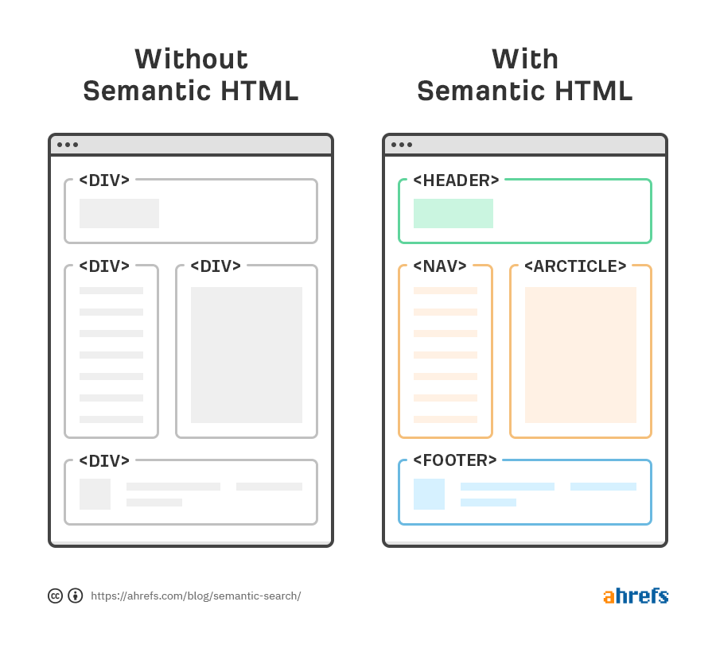

# Repositório: HTML_Semantico
O que é HTML Semântico e sua importância!

## O que é HTML semântico?
Vamos começar pela palavra **semântica** que, de forma resumida, é o estudo do significado e interpretação de palavras segundo o [Wikipédia](https://pt.wikipedia.org/wiki/Sem%C3%A2ntica) 

Quando aplicamos isso ao HTML, tornamos a estrutura de documentos escritos em HTML mais claros para os navegadores da WEB, para sistemas de busca do tipo **SEO (Search Engine Optimization)**, facilitamos o entendimento de outros programadores na hora de fazer uma manutenção na página e permitimos que leitores de tela consigam interpretar o HTML de forma semântica, o que colabora, e muito, para a acessibilidade de pessoas com alguma limitação visual e ou auditiva que utilizam esses leitores para acessar as páginas WEB.

Quando o [HTML](https://www.w3schools.com/html/) foi inventado, sua principal função era estruturar documentos para a web e facilitar a navegação através de hiperlinks, com o passar do tempo e a adoção da Internet em massa nas nossas vidas, todas as tecnologias envolvidas nesse contexto evoluiram e o HTML não poderia ficar de fora dessa evolução, por isso, em 2008, no surgimento da primeira versão do HTML5 já apareceram as primeiras tag's que nos permitiam dar um significado mais semântico para os conteúdos das nossas páginas.

Obs.: Muitos programadores ainda usam tag's como `div` e `span` para fazer a separação dos conteúdos e ou criar containers para agrupar elementos no HTML o que é um erro e uma má prática no mundo de desenvolvimento de sistemas WEB.

Exemplos:

## As principais TAG's semânticas do HTML

A tag `<header>`
Representa os elementos do cabeçalho, auxiliando para casos em que você possui uma logo ou nome da página em destaque, ou até mesmo título de artigo.

A tag `<aside>`
Geralmente usada para marcar elementos em barras laterais. Por exemplo, informações relacionadas ao artigo, avisos, biografia do autor etc.

Essa tag nos ajuda a definir, até mesmo para a própria compreensão do código, os conteúdos tratados nas laterais da página.

A tag `<section>`
É usada para dividir o conteúdo da página em seção e subseções. Seja dentro de um texto ou conteúdo principal, conseguimos dividir melhor esse conteúdo, deixando-o melhor organizado.

Geralmente trabalhamos com um título dentro dessa section, dando ênfase ao conteúdo dela.

E ai você poderia perguntar: “Qual seria a diferença de uma `<section>` e uma `
` então?”

Basicamente a diferença está na forma com as duas dividem seus conteúdos, a `<section>` consegue separar os conteúdos de forma diferente das `
`, por exemplo, ao utilizar um título `<h1 a h6>` em uma `
` não podemos repetir o mesmo titulo para varias `
` diferentes pois ao passar essa página pela pesquisa do google, algumas informações da página na busca poderiam se perder.

Já com a `<section>` podemos utilizar o mesmo título, pois a `<section>` separa seus conteúdos por seções e isso faz toda a diferença em mecanismos de busca e as informações não se perdem no processo.
  
A tag `<article>`
É usada para representar um artigo dentro do conteúdo. Pode ser uma citação de textos externos, ou referências, geralmente também usamos um título para essa tag.

A tag `<nav>`
Usamos para menus interativos, como por exemplo menus que encaminham a página de “sobre” ou “produtos”. O `<nav>` pode ser usado em qualquer momento na página, onde tenhamos agrupamento de links.
  
A tag `<main>`
É o principal elemento e basicamente indica aos leitores de tela e navegadores a parte que contém a seção principal do documento. Para melhor uso, só devemos ter um `<main>` por página, onde iremos apontar o conteúdo de maior relevância, podendo conter textos, imagens, links, etc.

Essa tag facilitou muito a compreensão para leitores de tela, já que enfatiza o texto dentro da tag, deixando clara sua importância.

A tag `<blockquote>`
É usada para representar uma citação de bloco, o conteúdo que será citado de uma fonte externa (uma pessoa, documento, jornal, estudo de caso, etc.).
  
A tag `<time>`
O elemento <time> é utilizado para informar a data e hora em um formato legível.

A tag `<figure>`
É utilizada para a inserção de figuras na página. Juntamente com essa tag trabalhamos com o atributo **alt** da tag ``, onde descrevemos o que há na imagem, facilitando então a acessibilidade da página, para os leitores de tela.

Além disso, se por algum motivo a imagem não abrir, haverá uma descrição dela para quem estiver acessando saber sobre o que a imagem representa.

A tag `<footer>`
Indica o rodapé do conteúdo. É a tag utilizada para o rodapé da página ou até de rodapé para artigos.

Normalmente utilizada para inserir a autoria da página, assim como contatos e data de criação de conteúdos.

Exemplo de estrutura de página semântica no HTML5:

  
Mais informações sobre HTML e suas tag's você encontra aqui na [documentação da mozilla](https://developer.mozilla.org/pt-BR/docs/Web/HTML/Element) ou no site da [W3Schools](https://www.w3schools.com/html/) que são as principais referncias no assunto!
